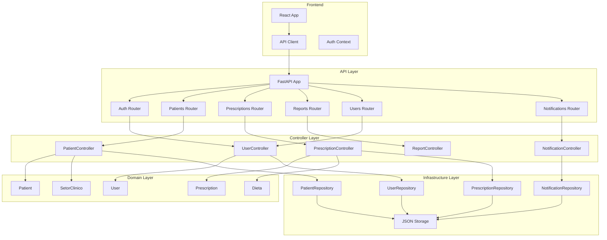

# 🏥 Sistema Nutricional Hospitalar (SNH)

<div align="center">


**Sistema completo de gestão de prescrições dietéticas hospitalares desenvolvido com Programação Orientada a Objetos**

[Sobre](#-sobre-o-projeto) •
[Funcionalidades](#-funcionalidades) •
[Arquitetura](#-arquitetura) •
[Tecnologias](#-tecnologias) •
[Instalação](#-instalação) •
[Uso](#-uso) •
[Testes](#-testes) •
[Equipe](#-equipe)

</div>

---

## 📋 Sobre o Projeto

O **Sistema Nutricional Hospitalar (SNH)** é uma aplicação full-stack desenvolvida para gerenciar prescrições dietéticas em ambientes hospitalares. O sistema permite que profissionais de saúde (nutricionistas, médicos, enfermeiros) criem, alterem e monitorem dietas personalizadas para pacientes internados.

### 🎯 Problema Resolvido

Em hospitais, o gerenciamento de dietas é complexo e crítico:
- Cada paciente tem necessidades nutricionais específicas
- Dietas variam por tipo (oral, enteral, parenteral, mista)
- Mudanças frequentes devido à evolução clínica
- Necessidade de rastreabilidade completa
- Notificações para equipe multidisciplinar
- Relatórios para auditoria e gestão

O SNH resolve esses problemas com uma solução robusta, orientada a objetos e com interface moderna.

### 💡 Por que Orientação a Objetos?

O domínio hospitalar é naturalmente orientado a objetos:
- **Hierarquias complexas**: Diferentes tipos de dietas com comportamentos especializados
- **Polimorfismo**: Processar qualquer tipo de dieta de forma uniforme
- **Encapsulamento**: Proteger regras críticas de negócio
- **Composição**: Prescrição composta de paciente, dieta, histórico
- **Extensibilidade**: Fácil adicionar novos tipos de dieta ou usuários

---

## ✨ Funcionalidades

### 🔐 **Autenticação e Autorização**
- Login com JWT
- Controle de acesso baseado em papéis (RBAC)
- 5 tipos de usuários com permissões diferentes:
  - **Administrador**: gestão total
  - **Médico**: prescrever e alterar dietas
  - **Nutricionista**: prescrever e alterar dietas
  - **Enfermeiro**: visualizar prescrições
  - **Copeiro**: visualizar dietas para preparação

### 👥 **Gestão de Pacientes**
- Cadastro completo de pacientes
- Organização por setores clínicos (UTI, Enfermaria, etc.)
- Controle de leitos
- Cálculo automático de risco (pacientes em UTI)
- Tempo de internação
- Transferência entre setores

### 🍽️ **Sistema de Dietas (4 tipos)**
1. **Dieta Oral**
   - Textura (normal, pastosa, líquida)
   - Número de refeições
   - Restrições alimentares
   - Validação de compatibilidade

2. **Dieta Enteral**
   - Via de infusão (nasogástrica, nasoenteral, gastrostomia)
   - Velocidade de infusão (ml/h)
   - Tipo de equipo
   - Cálculo de volume em 24h

3. **Dieta Parenteral**
   - Tipo de acesso (periférico, central)
   - Volume diário
   - Composição (glicose, aminoácidos, lipídios)
   - Validação volume vs velocidade

4. **Dieta Mista**
   - Combinação de múltiplas dietas
   - Cálculo consolidado de nutrientes

### 💊 **Prescrições**
- Criar prescrição para paciente
- Alterar dieta (mantém histórico completo)
- Encerrar prescrição
- Histórico imutável de alterações
- Auditoria (quem fez, quando)
- Notificações automáticas

### 📊 **Relatórios**
- Relatório de prescrições (ativas/encerradas)
- Relatório de pacientes (por setor, por risco)
- Relatório de dietas prescritas
- Dashboard completo
- Formatos: TXT, JSON, Markdown
- Filtros avançados

### 🔔 **Notificações**
- Notificações in-app
- Email (via SMTP)
- Push notifications
- Notificações para múltiplos destinatários
- Histórico de notificações

### 💾 **Persistência**
- Dados salvos em JSON
- Serialização/deserialização automática
- Backup de dados
- Repositórios com padrão Repository

---

## 🏗️ Arquitetura

O projeto segue **Clean Architecture** com camadas bem definidas:

```
┌─────────────────────────────────────────┐
│         PRESENTATION LAYER               │
│  (FastAPI Routes + React Components)     │
│  - Routers (auth, patients, etc)         │
│  - React Pages & Components              │
└─────────────────────────────────────────┘
                ↓ depends on
┌─────────────────────────────────────────┐
│        APPLICATION LAYER                 │
│  (Controllers + Services)                │
│  - UserController                        │
│  - PatientController                     │
│  - PrescriptionController                │
│  - ReportController                      │
│  - Factory, Notifier, Strategies         │
└─────────────────────────────────────────┘
                ↓ depends on
┌─────────────────────────────────────────┐
│           DOMAIN LAYER ★                 │
│  (Core Business Logic)                   │
│  - Patient, Prescription, User           │
│  - Diets (Oral, Enteral, Parenteral)     │
│  - SetorClinico, HistoricoAlteracao      │
│  - Base classes, Mixins                  │
└─────────────────────────────────────────┘
                ↑ used by
┌─────────────────────────────────────────┐
│      INFRASTRUCTURE LAYER                │
│  (External Concerns)                     │
│  - JSON Repositories                     │
│  - Serializers/Deserializers             │
│  - File Storage                          │
└─────────────────────────────────────────┘
```

### 📐 Princípios Aplicados

#### **SOLID**
- ✅ **S**ingle Responsibility: Cada classe tem uma responsabilidade
- ✅ **O**pen/Closed: Hierarquias extensíveis sem modificar código
- ✅ **L**iskov Substitution: Subclasses podem substituir bases
- ✅ **I**nterface Segregation: Interfaces específicas
- ✅ **D**ependency Inversion: Depende de abstrações

#### **Padrões de Projeto (GoF)**
- 🏭 **Factory Method**: DietaFactory para criar dietas
- 🔔 **Observer**: NotificadorService + Observadores
- 🎯 **Strategy**: Estratégias de notificação (Email, Push, InApp)
- 🧱 **Repository**: Persistência de dados
- 🔗 **Adapter**: Serialização JSON

---

## 🛠️ Tecnologias

### **Backend**
- **Python 3.11+**: Linguagem principal
- **FastAPI**: Framework web assíncrono
- **Pydantic**: Validação de dados
- **Pytest**: Testes automatizados
- **JWT**: Autenticação
- **Poetry**: Gerenciamento de dependências

### **Frontend**
- **React 18**: Framework UI
- **TypeScript**: Tipagem estática
- **Vite**: Build tool
- **Tailwind CSS**: Estilização
- **shadcn/ui**: Componentes
- **Axios**: Cliente HTTP
- **Recharts**: Gráficos
- **Lucide React**: Ícones

### **Persistência**
- **JSON**: Armazenamento de dados
- **File System**: Arquivos locais

---

## 📊 Diagrama UML (Mermaid)

### Diagrama de Classes Principal

```mermaid
classDiagram
    %% Mixins Base
    class AuditoriaMixin {
        <<abstract>>
        -_criado_em: datetime
        -_atualizado_em: datetime
        -_usuario_responsavel: str
        +criado_em() datetime
        +atualizado_em() datetime
        +usuario_responsavel() str
        +registrar_atualizacao() void
    }

    class StatusDietaMixin {
        <<abstract>>
        -_ativo: bool
        -_data_inicio: datetime
        -_data_fim: datetime?
        +ativo() bool
        +data_inicio() datetime
        +data_fim() datetime?
        +encerrar_dieta() void
    }

    %% Dieta Hierarchy
    class Dieta {
        <<abstract>>
        -_descricao: str
        -_itens: List~ItemCardapio~
        +descricao() str
        +itens() List
        +adicionar_item(item) void
        +calcular_nutrientes()* dict
    }

    class ItemCardapio {
        <<value object>>
        -_nome: str
        -_quantidade_gramas: float
        -_restricoes: Tuple
        +nome() str
        +quantidade_gramas() float
        +restricoes() Tuple
    }

    class DietaOral {
        -_textura: str
        -_numero_refeicoes: int
        -_tipo_refeicao: str
        -_restricoes_proibidas: Set
        +textura() str
        +numero_refeicoes() int
        +adicionar_restricao_proibida(r) void
        +validar_compatibilidade() bool
        +calcular_nutrientes() dict
    }

    class DietaEnteral {
        -_via_infusao: str
        -_velocidade_ml_h: float
        -_tipo_equipo: str
        -_porcoes_diarias: int
        +via_infusao() str
        +velocidade_ml_h() float
        +volume_infundido_24h() float
        +calcular_nutrientes() dict
    }

    class DietaParenteral {
        -_tipo_acesso: str
        -_volume_ml_dia: float
        -_composicao: str
        -_velocidade_ml_h: float
        +tipo_acesso() str
        +volume_ml_dia() float
        +percentual_volume_atingido() float
        +calcular_nutrientes() dict
    }

    class DietaMista {
        -_dietas: List~Dieta~
        +dietas() List
        +adicionar_dieta(d) void
        +calcular_nutrientes() dict
    }

    %% Domain Entities
    class SetorClinico {
        -_nome: str
        -_lista_pacientes: Dict~int,Paciente~
        +nome() str
        +lista_pacientes() List
        +adicionar_paciente(p) void
        +remover_paciente(p) void
        +buscar_paciente_por_nome(n) Paciente?
        +leitos_ocupados() int
    }

    class Paciente {
        -_nome: str
        -_dataNasc: str
        -_setorClinico: SetorClinico
        -_leito: int
        -_datain: datetime
        -_risco: bool
        +nome() str
        +setor_nome() str
        +leito() int
        +risco() bool
        +transferir_para_setor(s) void
        +obter_tempo_internacao() int
    }

    class HistoricoAlteracao {
        <<value object>>
        -_data_hora: datetime
        -_tipo_alteracao: str
        -_descricao: str
        -_usuario: str
        +data_hora() datetime
        +tipo_alteracao() str
        +descricao() str
        +usuario() str
    }

    class Prescricao {
        -_paciente: Paciente
        -_dieta: Dieta
        -_notificador: NotificadorService
        -_historico: List~HistoricoAlteracao~
        -_ativa: bool
        -_id: int
        +paciente() Paciente
        +dieta() Dieta
        +ativa() bool
        +historico() List
        +id_prescricao() int
        +alterar_dieta(d, u) void
        +encerrar(u) void
        +obter_resumo() dict
    }

    %% User Hierarchy
    class Usuario {
        <<abstract>>
        -_nome: str
        -_cpf: str
        -_email: str
        -_tipo: TipoUsuario
        -_status: StatusUsuario
        +nome() str
        +cpf() str
        +email() str
        +tipo() TipoUsuario
        +status() StatusUsuario
        +pode_prescrever_dieta()* bool
        +pode_alterar_prescricao()* bool
        +pode_visualizar_prescricoes()* bool
        +registrar_acesso() void
        +ativar() void
        +inativar() void
        +bloquear() void
    }

    class Nutricionista {
        -_crn: str
        +crn() str
        +pode_prescrever_dieta() bool
        +pode_alterar_prescricao() bool
        +pode_visualizar_prescricoes() bool
    }

    class Medico {
        -_crm: str
        -_especialidade: str
        +crm() str
        +especialidade() str
        +pode_prescrever_dieta() bool
        +pode_alterar_prescricao() bool
    }

    class Enfermeiro {
        -_coren: str
        -_setor: str
        +coren() str
        +setor() str
        +pode_prescrever_dieta() bool
        +pode_visualizar_prescricoes() bool
    }

    class Copeiro {
        -_turno: str
        +turno() str
        +pode_prescrever_dieta() bool
        +pode_visualizar_prescricoes() bool
    }

    class Administrador {
        +pode_prescrever_dieta() bool
        +pode_alterar_prescricao() bool
        +pode_visualizar_prescricoes() bool
    }

    %% Services
    class DietaFactory {
        <<static>>
        +criar_dieta(tipo, dados) Dieta
        -_criar_dieta_oral(dados) DietaOral
        -_criar_dieta_enteral(dados) DietaEnteral
        -_criar_dieta_parenteral(dados) DietaParenteral
        -_criar_dieta_mista(dados) DietaMista
    }

    class NotificadorService {
        -_observadores: Dict
        -_destinatarios: Dict
        +registrar_observador(c, e, d) void
        +notificar_mudanca(id, msg) void
        +total_observadores() int
    }

    class EstrategiaNotificacao {
        <<abstract>>
        +enviar(msg, dest)* void
    }

    class NotificacaoEmail {
        +enviar(msg, dest) void
    }

    class NotificacaoPush {
        +enviar(msg, dest) void
    }

    class NotificacaoInApp {
        -_repositorio: NotificationRepository
        +enviar(msg, dest) void
    }

    %% Relationships
    Dieta <|-- DietaOral
    Dieta <|-- DietaEnteral
    Dieta <|-- DietaParenteral
    Dieta <|-- DietaMista
    Dieta --|> AuditoriaMixin
    Dieta --|> StatusDietaMixin
    Dieta o-- ItemCardapio

    Usuario <|-- Nutricionista
    Usuario <|-- Medico
    Usuario <|-- Enfermeiro
    Usuario <|-- Copeiro
    Usuario <|-- Administrador
    Usuario --|> AuditoriaMixin

    Paciente --|> AuditoriaMixin
    Paciente --> SetorClinico
    SetorClinico o-- Paciente

    Prescricao --|> AuditoriaMixin
    Prescricao --> Paciente
    Prescricao --> Dieta
    Prescricao --> NotificadorService
    Prescricao *-- HistoricoAlteracao

    DietaMista o-- Dieta

    EstrategiaNotificacao <|-- NotificacaoEmail
    EstrategiaNotificacao <|-- NotificacaoPush
    EstrategiaNotificacao <|-- NotificacaoInApp
    NotificadorService --> EstrategiaNotificacao
```



### Diagrama de Componentes da API



---

## 📁 Estrutura do Projeto

```
snh-feature-frontend/
│
├── backend/                          # Backend FastAPI
│   ├── src/snh_project/
│   │   ├── api/                      # API Layer
│   │   │   ├── routers/              # Endpoints REST
│   │   │   │   ├── auth.py           # Autenticação
│   │   │   │   ├── patients.py       # Pacientes
│   │   │   │   ├── prescriptions.py  # Prescrições
│   │   │   │   ├── reports.py        # Relatórios
│   │   │   │   ├── users.py          # Usuários
│   │   │   │   └── notifications.py  # Notificações
│   │   │   ├── schemas/              # Pydantic Schemas
│   │   │   │   ├── auth.py
│   │   │   │   ├── patient.py
│   │   │   │   ├── prescription.py
│   │   │   │   ├── report.py
│   │   │   │   └── user.py
│   │   │   ├── app.py                # FastAPI App
│   │   │   ├── auth.py               # JWT Logic
│   │   │   └── dependencies.py       # Dependency Injection
│   │   │
│   │   ├── controllers/              # Application Layer
│   │   │   ├── user_controller.py
│   │   │   ├── patient_controller.py
│   │   │   ├── prescription_controller.py
│   │   │   ├── report_controller.py
│   │   │   └── notification_controller.py
│   │   │
│   │   ├── core/                     # Domain Layer ★
│   │   │   ├── diets/                # Hierarquia de Dietas
│   │   │   │   ├── __init__.py
│   │   │   │   ├── item_cardapio.py
│   │   │   │   ├── dieta_oral.py
│   │   │   │   ├── dieta_enteral.py
│   │   │   │   ├── dieta_parenteral.py
│   │   │   │   └── dieta_mista.py
│   │   │   ├── base.py               # AuditoriaMixin, StatusDietaMixin, Dieta
│   │   │   ├── patient.py            # Paciente
│   │   │   ├── prescription.py       # Prescricao, HistoricoAlteracao
│   │   │   ├── setorclin.py          # SetorClinico
│   │   │   └── user.py               # Usuario + hierarquia
│   │   │
│   │   ├── services/                 # Services
│   │   │   ├── factory.py            # DietaFactory (Factory Method)
│   │   │   ├── notifier.py           # NotificadorService (Observer)
│   │   │   └── strategies.py         # Estratégias de notificação (Strategy)
│   │   │
│   │   └── infrastructure/           # Infrastructure Layer
│   │       ├── json_repository.py    # Base Repository
│   │       ├── user_repository.py
│   │       ├── patient_repository.py
│   │       ├── prescription_repository.py
│   │       ├── notification_repository.py
│   │       ├── setor_repository.py
│   │       └── serializers.py        # JSON Serializers
│   │
│   ├── tests/                        # Testes (70+ testes)
│   │   ├── test_auth.py
│   │   ├── test_user.py
│   │   ├── test_patient.py
│   │   ├── test_prescription.py
│   │   ├── test_dietaoral.py
│   │   ├── test_dietaenteral.py
│   │   ├── test_factory.py
│   │   ├── test_notifier.py
│   │   ├── test_strategies.py
│   │   └── ...
│   │
│   ├── data/                         # Dados persistidos (JSON)
│   │   ├── users.json
│   │   ├── patients.json
│   │   ├── prescriptions.json
│   │   ├── notifications.json
│   │   └── setores.json
│   │
│   ├── main.py                       # Script de demo (não é o entrypoint da API)
│   ├── pyproject.toml                # Poetry dependencies
│   └── README.md
│
├── frontend/                         # Frontend React
│   ├── src/
│   │   ├── components/
│   │   │   ├── ui/                   # shadcn/ui components
│   │   │   ├── Layout.tsx
│   │   │   ├── Sidebar.tsx
│   │   │   └── ...
│   │   ├── contexts/
│   │   │   └── AppContext.tsx        # Estado global
│   │   ├── lib/
│   │   │   ├── api.ts                # Cliente API
│   │   │   └── auth.ts               # Auth logic
│   │   ├── types/
│   │   │   └── index.ts              # TypeScript types
│   │   ├── App.tsx                   # App principal
│   │   └── main.tsx                  # Entrypoint
│   │
│   ├── package.json
│   ├── tsconfig.json
│   ├── vite.config.ts
│   └── tailwind.config.js
│
├── .gitignore
├── LICENSE
└── README.md                         # Este arquivo
```

---

## 🚀 Instalação

### Pré-requisitos

- **Python 3.11+**
- **Node.js 18+** e **npm**
- **Poetry** (gerenciador de dependências Python)

### 1. Clonar Repositório

```bash
git clone https://github.com/sistema-nutricional-hospitalar/snh/tree/main
cd snh-project
```

### 2. Backend (FastAPI)

```bash
cd backend

# Instalar Poetry (se não tiver)
pip install poetry

# Instalar dependências
poetry install

# Criar diretórios necessários (se não existirem)
mkdir -p data

# Rodar servidor (desenvolvimento)
poetry run uvicorn src.snh_project.api.app:app --reload --port 8000
```

**Backend estará rodando em:** `http://localhost:8000`

**Documentação da API:** `http://localhost:8000/docs`

### 3. Frontend (React)

```bash
cd frontend

# Instalar dependências
npm install

# Rodar em desenvolvimento
npm run dev
```

**Frontend estará rodando em:** `http://localhost:5173`

---

## 💻 Uso

### 1. Acessar a Aplicação

Abra o navegador em: `http://localhost:5173`

### 2. Login

**Usuário padrão (Admin):**
- Email: `admin@snh.com`
- Senha: `admin123`

**Outros usuários de teste:**
```
Nutricionista:
- Email: nutricionista@snh.com
- Senha: nutri123

Copeiro:
- Email: copeiro@snh.com
- Senha: copeiro123
```

**Observação:** Médico e Enfermeiro existem no backend mas não têm login no frontend.
### 3. Funcionalidades Principais

#### **Dashboard**
- Visão geral do sistema
- Estatísticas (total de pacientes, prescrições ativas, etc)
- Gráficos
- Alertas importantes

#### **Pacientes**
- Cadastrar novo paciente
- Listar todos os pacientes
- Editar informações
- Transferir entre setores
- Ver histórico de prescrições

#### **Prescrições**
- Criar nova prescrição
- Escolher tipo de dieta (Oral, Enteral, Parenteral, Mista)
- Alterar dieta de prescrição existente
- Encerrar prescrição
- Ver histórico completo de alterações

#### **Relatórios**
- Gerar relatório de prescrições (filtros: ativas/encerradas)
- Gerar relatório de pacientes (filtros: setor, risco)
- Gerar relatório de dietas
- Download em múltiplos formatos (TXT, JSON, MD)

#### **Usuários** (apenas Admin)
- Cadastrar novos usuários
- Editar permissões
- Ativar/inativar/bloquear usuários
- Visualizar atividades

#### **Notificações**
- Ver notificações recebidas
- Marcar como lida
- Filtrar por tipo
- Configurar preferências

---

## 🧪 Testes

O projeto possui **70+ testes automatizados** com alta cobertura.

### Executar Testes

```bash
cd backend

# Rodar todos os testes
poetry run pytest

# Rodar com cobertura
poetry run pytest --cov=src/snh_project --cov-report=html

# Rodar testes específicos
poetry run pytest tests/test_prescription.py
poetry run pytest tests/test_user.py -v
```

### Categorias de Testes

- ✅ **Testes de Unidade** (classes individuais)
- ✅ **Testes de Integração** (controllers + repositórios)
- ✅ **Testes de API** (endpoints REST)
- ✅ **Testes de Autenticação** (JWT, permissões)
- ✅ **Testes de Validação** (regras de negócio)

### Exemplos de Testes

```python
# test_prescription.py
def test_criar_prescricao_valida()
def test_alterar_dieta_atualiza_historico()
def test_erro_alterar_prescricao_encerrada()

# test_user.py
def test_nutricionista_pode_prescrever()
def test_enfermeiro_nao_pode_prescrever()
def test_validacao_cpf_invalido()

# test_dietaoral.py
def test_adicionar_item_compativel()
def test_erro_item_com_restricao_proibida()
```

---

## 📚 Documentação da API

A API é documentada automaticamente com **Swagger/OpenAPI**.

Acesse: `http://localhost:8000/docs`

### Principais Endpoints

#### **Autenticação**
```http
POST /api/auth/login
POST /api/auth/refresh
POST /api/auth/logout
```

#### **Pacientes**
```http
GET    /api/patients
POST   /api/patients
GET    /api/patients/{id}
PUT    /api/patients/{id}
DELETE /api/patients/{id}
POST   /api/patients/{id}/transfer
```

#### **Prescrições**
```http
GET    /api/prescriptions
POST   /api/prescriptions
GET    /api/prescriptions/{id}
PUT    /api/prescriptions/{id}/diet
POST   /api/prescriptions/{id}/close
GET    /api/prescriptions/patient/{patient_id}
```

#### **Relatórios**
```http
POST   /api/reports/prescriptions
POST   /api/reports/patients
POST   /api/reports/diets
POST   /api/reports/dashboard
```

#### **Usuários**
```http
GET    /api/users
POST   /api/users
GET    /api/users/{cpf}
PUT    /api/users/{cpf}
DELETE /api/users/{cpf}
PATCH  /api/users/{cpf}/activate
PATCH  /api/users/{cpf}/deactivate
```

---

## 🎓 Conceitos de POO Implementados

### **1. Encapsulamento**
```python
class Paciente(AuditoriaMixin):
    def __init__(self, nome, dataNasc, ...):
        self._nome = nome  # Atributo privado
        self._dataNasc = dataNasc
    
    @property
    def nome(self):  # Acesso controlado
        return self._nome
    
    @nome.setter
    def nome(self, valor):  # Validação
        if not valor or len(valor.strip()) == 0:
            raise ValueError("Nome não pode ser vazio")
        self._nome = valor.strip()
```

### **2. Herança e Polimorfismo**
```python
class Dieta(ABC, AuditoriaMixin, StatusDietaMixin):
    @abstractmethod
    def calcular_nutrientes(self) -> dict:
        pass

class DietaOral(Dieta):
    def calcular_nutrientes(self) -> dict:
        # Implementação específica para oral
        return {...}

class DietaEnteral(Dieta):
    def calcular_nutrientes(self) -> dict:
        # Implementação específica para enteral
        return {...}

# Polimorfismo em ação
dietas: List[Dieta] = [DietaOral(), DietaEnteral()]
for dieta in dietas:
    nutrientes = dieta.calcular_nutrientes()  # Chama implementação correta
```

### **3. Herança Múltipla (Mixins)**
```python
class Dieta(ABC, AuditoriaMixin, StatusDietaMixin):
    # Herda comportamento de auditoria e status
    pass

# Mixins fornecem funcionalidades reutilizáveis
class AuditoriaMixin:
    def registrar_atualizacao(self):
        self._atualizado_em = datetime.now()
```

### **4. Composição**
```python
class Prescricao:
    def __init__(self, paciente, dieta, notificador):
        self._paciente = paciente  # Composição
        self._dieta = dieta
        self._historico = []  # Lista de HistoricoAlteracao
```

### **5. Agregação**
```python
class SetorClinico:
    def __init__(self, nome):
        self._lista_pacientes = {}  # Agregação - pacientes podem existir independentemente
    
    def adicionar_paciente(self, paciente):
        self._lista_pacientes[paciente.leito] = paciente
```

### **6. Classes Abstratas**
```python
class Usuario(ABC, AuditoriaMixin):
    @abstractmethod
    def pode_prescrever_dieta(self) -> bool:
        pass  # Forçar implementação nas subclasses
```

### **7. Factory Pattern**
```python
class DietaFactory:
    @staticmethod
    def criar_dieta(tipo: str, dados: dict) -> Dieta:
        if tipo == 'oral':
            return DietaOral(...)
        elif tipo == 'enteral':
            return DietaEnteral(...)
        # Desacopla criação de implementação
```

### **8. Observer Pattern**
```python
class NotificadorService:
    def __init__(self):
        self._observadores = {}
    
    def registrar_observador(self, canal, estrategia, destinatarios):
        self._observadores[canal] = {...}
    
    def notificar_mudanca(self, id_paciente, mensagem):
        for obs in self._observadores.values():
            obs['estrategia'].enviar(mensagem, obs['destinatarios'])
```

### **9. Strategy Pattern**
```python
class EstrategiaNotificacao(ABC):
    @abstractmethod
    def enviar(self, mensagem, destinatarios):
        pass

class NotificacaoEmail(EstrategiaNotificacao):
    def enviar(self, mensagem, destinatarios):
        # Envia por email

class NotificacaoPush(EstrategiaNotificacao):
    def enviar(self, mensagem, destinatarios):
        # Envia push notification
```

### **10. Repository Pattern**
```python
class JsonRepository(ABC):
    @abstractmethod
    def save(self, entity):
        pass
    
    @abstractmethod
    def find_by_id(self, id):
        pass

class UserRepository(JsonRepository):
    def save(self, user):
        # Implementação concreta
```

---

## 👥 Equipe

### **Integrantes**

| Nome | GitHub | Responsabilidades |
|------|--------|-------------------|
| **David Josué Vital Santos** | [@davidvital-dev](https://github.com/davidvital-dev) | Hierarquia de Dietas, Testes de Dietas, Correção de Bugs |
| **Jetro Kepler Gomes Alencar Gonzaga Viana** | [@jetrokepler](https://github.com/jetrokepler) | Prescrições, Histórico, Testes de Prescrição, Frontend completo |
| **Ângelo Gabriel Alves Freire Duarte** | [@Angelo-Gabriel-Dev](https://github.com/Angelo-Gabriel-Dev) | Hierarquia de Usuários, Factory, Notifier, Strategies |
| **Dorian Dayvid Gomes Feitosa** | [@OtherDinosaur](https://github.com/OtherDinosaur) | Pacientes, Setores, Repositórios, Serializers |

---

## 🌟 Destaques do Projeto

### **Conformidade com Requisitos**

✅ **12+ classes próprias** (18 classes de domínio)  
✅ **Hierarquias de abstração** (Dieta, Usuario)  
✅ **Herança múltipla** (Mixins)  
✅ **Polimorfismo estratégico** (calcular_nutrientes, permissões)  
✅ **Composição e Agregação** (Prescricao, SetorClinico)  
✅ **Arquitetura em camadas** (4 camadas)  
✅ **SOLID completo** (todos os 5 princípios)  
✅ **3 Padrões de Projeto** (Factory, Observer, Strategy)  
✅ **70+ testes automatizados**  
✅ **Documentação completa** (docstrings, README, UML)

---

## 📄 Licença

Este projeto está sob a licença MIT. Veja o arquivo [LICENSE](LICENSE) para mais detalhes.

---

<div align="center">

**Universidade Federal do Cariri - UFCA**  
**Engenharia de Software - 2026.1**

[⬆ Voltar ao topo](#-sistema-nutricional-hospitalar-snh)

</div>